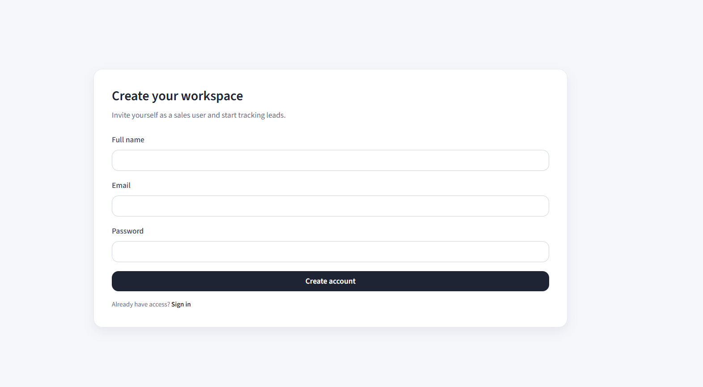

# Smart Leads Dashboard

A production-ready MERN dashboard for tracking sales leads with role-based access, advanced filtering, and CSV exports. Built as a realistic internship-ready submission with clean architecture and a polished UI.

                          Registration Page

                      Login Page

                        Dashboard Page

                Add_lead 

## Features

- JWT authentication with role-based access
- Lead CRUD with validation
- Combined filters + debounced search + sorting
- Backend pagination with metadata
- CSV export of filtered leads
- Responsive dashboard UI with dark mode
- Dockerized frontend, backend, and MongoDB

## Tech Stack

- React + TypeScript + TailwindCSS
- React Router, Axios, Context API
- Node.js + Express + TypeScript
- MongoDB + Mongoose
- JWT + bcrypt

## Project Structure

```
.
├── backend
├── frontend
├── docs
└── docker-compose.yml
```

## Setup Instructions

### 1) Environment

Copy env files:

```
cp .env.example .env
cp backend/.env.example backend/.env
cp frontend/.env.example frontend/.env
```

Update values as needed.

### 2) Install Dependencies

Backend:

```
cd backend
npm install
```

Frontend:

```
cd frontend
npm install
```

### 3) Run in Development

Backend:

```
cd backend
npm run dev
```

Frontend:

```
cd frontend
npm run dev
```

### 4) Seed Admin User

```
cd backend
npm run seed:admin
```

## Docker

```
docker compose up --build
```

Frontend will be available on `http://localhost:5173` and backend on `http://localhost:4000`.

## Environment Variables

Backend:

- `MONGO_URL`
- `JWT_SECRET`
- `JWT_EXPIRES_IN`
- `CORS_ORIGIN`
- `PORT`
- `ADMIN_NAME`
- `ADMIN_EMAIL`
- `ADMIN_PASSWORD`

Frontend:

- `VITE_API_URL`

## API Routes

See [docs/api.md](docs/api.md)

## Deployment Guide

1. Build Docker images and push to registry.
2. Provision MongoDB (Atlas or managed) and set `MONGO_URL`.
3. Deploy backend container with environment variables.
4. Deploy frontend container with `VITE_API_URL` pointing to the backend.
5. Run the admin seed command once.

## Example MongoDB Schema

Lead:

```
{
  name: String,
  email: String,
  status: "New" | "Contacted" | "Qualified" | "Lost",
  source: "Website" | "Instagram" | "Referral",
  createdAt: Date
}
```

User:

```
{
  name: String,
  email: String,
  role: "admin" | "sales",
  password: String,
  createdAt: Date
}
```
