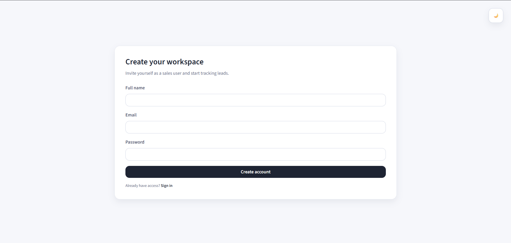
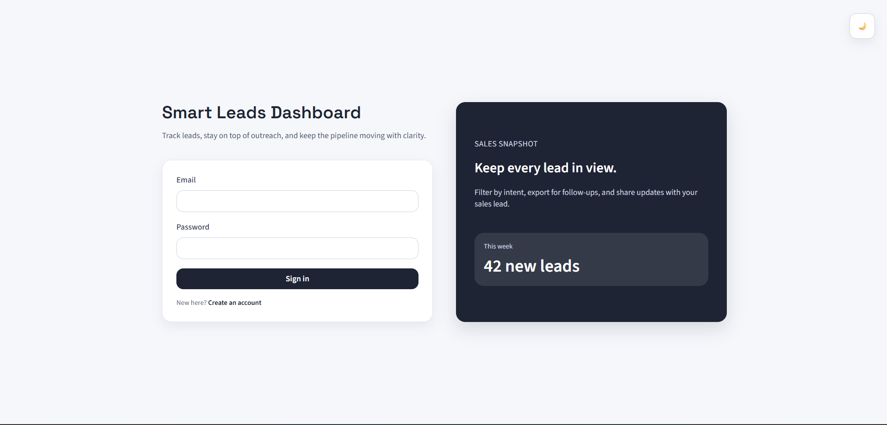
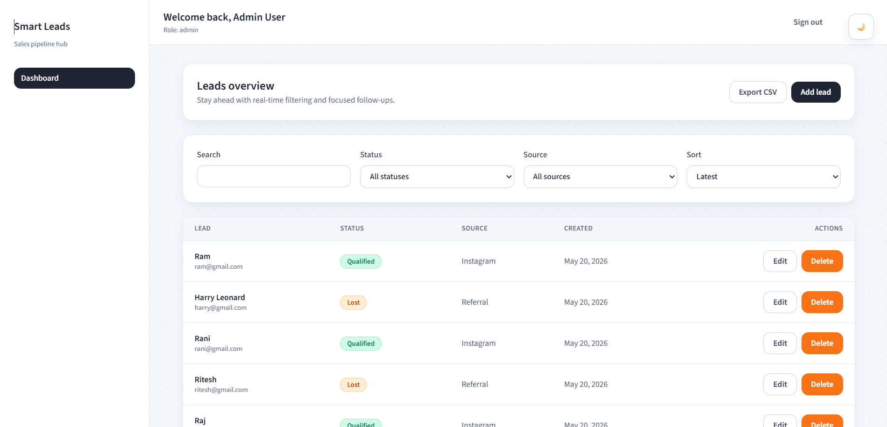
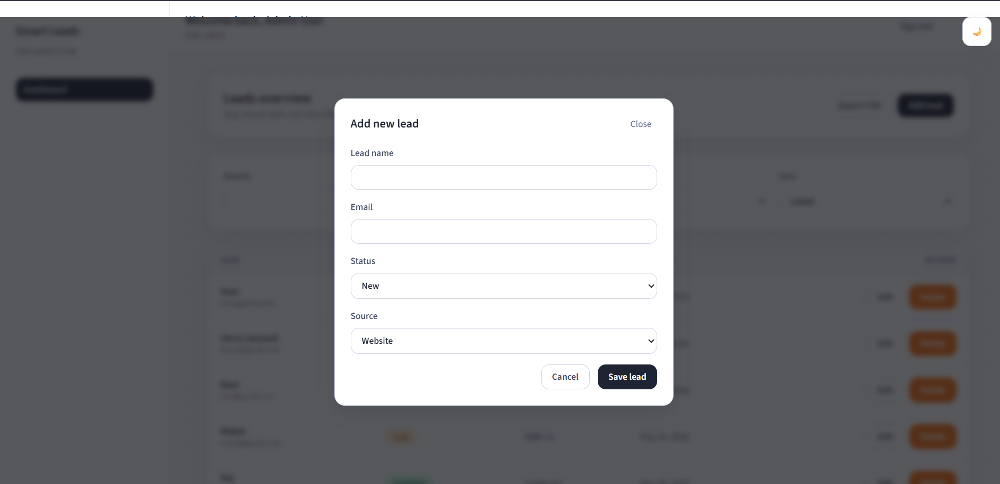
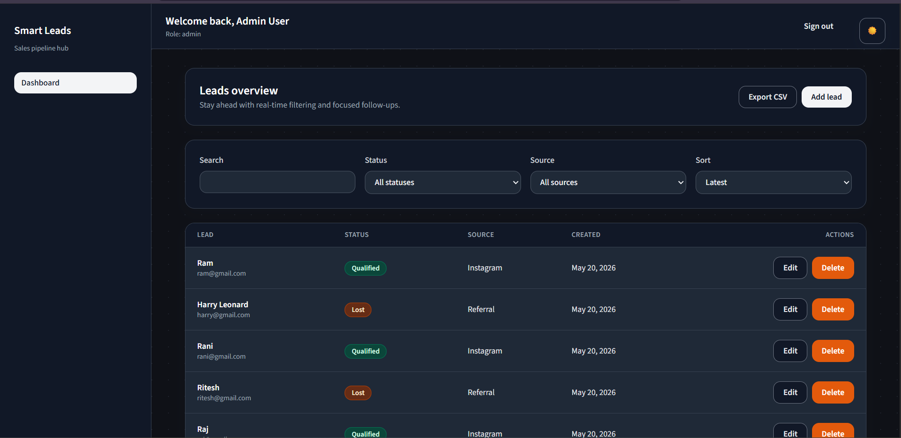

# Smart Leads Dashboard

A production-ready MERN dashboard for tracking sales leads with role-based access, advanced filtering, dark mode, pagination, and CSV export. The project keeps the original Smart Leads branding and structure while tightening backend security, polishing the UI, and improving documentation for a realistic internship-style submission.

## Screenshots



Registration Page



Login Page



Dashboard Page



Add Lead Modal



Dark Mode Dashboard

## Features

- JWT authentication with persistent sessions
- Proper role-based access control for `admin` and `sales`
- Lead create, read, update, and delete flows with validation
- Debounced search, filtering, sorting, and backend pagination
- CSV export for admins only
- Responsive dashboard with polished light and dark mode
- Docker setup for frontend, backend, and MongoDB

## Role Permissions

| Action | Admin | Sales |
| --- | --- | --- |
| View leads | Yes | Yes |
| Create leads | Yes | Yes |
| Edit leads | Yes | Yes |
| Delete leads | Yes | No |
| Export CSV | Yes | No |
| Access admin-only actions | Yes | No |

Notes:

- New registrations always create a `sales` user.
- Admin access is created through the seed script.
- Role checks are enforced in both the frontend and backend.
- Unauthorized admin actions return `403 Forbidden` from the API even if someone tries the request directly from Postman or the browser.

## Tech Stack

### Frontend

- React 18
- TypeScript
- Vite
- Tailwind CSS
- React Router
- Axios
- Context API

### Backend

- Node.js
- Express
- TypeScript
- MongoDB
- Mongoose
- JWT
- bcryptjs
- Zod

## Architecture

### Frontend Architecture

- `src/api`: Axios client and request helpers for auth and leads
- `src/components`: Reusable UI building blocks like buttons, modal, table, pagination, and form fields
- `src/components/layout`: Shared app shell pieces such as sidebar and topbar
- `src/context`: Auth and theme state for the whole app
- `src/hooks`: Small reusable hooks like auth access, theme access, and debounced search
- `src/pages`: Route-level screens such as login, register, dashboard, and lead details
- `src/utils`: Shared TypeScript types, formatting helpers, and API error helpers

### Backend Architecture

- `src/config`: Environment parsing and MongoDB connection
- `src/controllers`: Request handlers for auth and lead routes
- `src/middleware`: Authentication, role checks, error handling, and 404 handling
- `src/models`: Mongoose schemas for users and leads
- `src/routes`: Express route definitions
- `src/services`: Business logic for auth and lead operations
- `src/types`: Express and library type declarations
- `src/validators`: Zod schemas for request body and query validation

## Project Structure

```text
.
|-- backend
|   |-- src
|   |   |-- config
|   |   |   |-- db.ts
|   |   |   `-- env.ts
|   |   |-- controllers
|   |   |   |-- authController.ts
|   |   |   `-- leadController.ts
|   |   |-- middleware
|   |   |   |-- auth.ts
|   |   |   |-- errorHandler.ts
|   |   |   |-- notFound.ts
|   |   |   `-- role.ts
|   |   |-- models
|   |   |   |-- Lead.ts
|   |   |   `-- User.ts
|   |   |-- routes
|   |   |   |-- authRoutes.ts
|   |   |   `-- leadRoutes.ts
|   |   |-- services
|   |   |   |-- authService.ts
|   |   |   `-- leadService.ts
|   |   |-- types
|   |   |   |-- express.d.ts
|   |   |   `-- json2csv.d.ts
|   |   |-- validators
|   |   |   |-- authValidators.ts
|   |   |   |-- leadValidators.ts
|   |   |   `-- validate.ts
|   |   |-- app.ts
|   |   |-- seedAdmin.ts
|   |   `-- server.ts
|   |-- .env.example
|   |-- Dockerfile
|   |-- package.json
|   |-- tsconfig.build.json
|   `-- tsconfig.json
|-- docs
|   `-- api.md
|-- frontend
|   |-- src
|   |   |-- api
|   |   |   |-- authApi.ts
|   |   |   |-- client.ts
|   |   |   `-- leadsApi.ts
|   |   |-- components
|   |   |   |-- layout
|   |   |   |   |-- AppShell.tsx
|   |   |   |   |-- Sidebar.tsx
|   |   |   |   `-- Topbar.tsx
|   |   |   |-- Badge.tsx
|   |   |   |-- Button.tsx
|   |   |   |-- EmptyState.tsx
|   |   |   |-- InputField.tsx
|   |   |   |-- LeadFormModal.tsx
|   |   |   |-- LeadTable.tsx
|   |   |   |-- LoadingBlock.tsx
|   |   |   |-- Modal.tsx
|   |   |   |-- Pagination.tsx
|   |   |   |-- ProtectedRoute.tsx
|   |   |   |-- RoleGate.tsx
|   |   |   `-- SelectField.tsx
|   |   |-- context
|   |   |   |-- AuthContext.tsx
|   |   |   `-- ThemeContext.tsx
|   |   |-- hooks
|   |   |   |-- useAuth.ts
|   |   |   |-- useDebouncedValue.ts
|   |   |   `-- useTheme.ts
|   |   |-- pages
|   |   |   |-- DashboardPage.tsx
|   |   |   |-- LeadDetailsPage.tsx
|   |   |   |-- LoginPage.tsx
|   |   |   `-- RegisterPage.tsx
|   |   |-- styles
|   |   |   `-- index.css
|   |   |-- utils
|   |   |   |-- apiError.ts
|   |   |   |-- authEvents.ts
|   |   |   |-- formatDate.ts
|   |   |   `-- types.ts
|   |   |-- App.tsx
|   |   `-- main.tsx
|   |-- .env.example
|   |-- Dockerfile
|   |-- index.html
|   |-- nginx.conf
|   |-- package.json
|   |-- tailwind.config.ts
|   |-- tsconfig.json
|   |-- tsconfig.node.json
|   `-- vite.config.ts
|-- screenshots
|   |-- add_lead.png
|   |-- dark.png
|   |-- dashboard.png
|   |-- login.png
|   `-- register.png
|-- .env.example
|-- docker-compose.yml
`-- README.md
```

## Environment Setup

There are three environment files used in this project:

1. Root `.env`
   - Used by `docker-compose.yml`
   - Controls container ports, backend env values, and frontend build API URL
2. `backend/.env`
   - Used for local backend development
3. `frontend/.env`
   - Used for local frontend development

### Root `.env`

Copy the root template:

```bash
cp .env.example .env
```

Example variables:

```env
BACKEND_PORT=4000
FRONTEND_PORT=5173
MONGO_URL=mongodb://mongo:27017/smartleads
JWT_SECRET=change_me_to_a_long_secret
JWT_EXPIRES_IN=7d
CORS_ORIGIN=http://localhost:5173
VITE_API_URL=http://localhost:4000/api
ADMIN_NAME=Admin User
ADMIN_EMAIL=admin@smartleads.local
ADMIN_PASSWORD=ChangeMe123!
```

### Backend `.env`

Copy the backend template:

```bash
cp backend/.env.example backend/.env
```

Required backend variables:

- `NODE_ENV`
- `PORT`
- `MONGO_URL`
- `JWT_SECRET`
- `JWT_EXPIRES_IN`
- `CORS_ORIGIN`
- `ADMIN_NAME`
- `ADMIN_EMAIL`
- `ADMIN_PASSWORD`

### Frontend `.env`

Copy the frontend template:

```bash
cp frontend/.env.example frontend/.env
```

Required frontend variable:

- `VITE_API_URL`

## Local Development Setup

### Prerequisites

- Node.js 20+
- npm 10+
- MongoDB running locally or through Docker

### 1. Install Dependencies

Backend:

```bash
cd backend
npm install
```

Frontend:

```bash
cd frontend
npm install
```

### 2. Start the Backend

```bash
cd backend
npm run dev
```

Backend default URL:

```text
http://localhost:4000
```

### 3. Start the Frontend

```bash
cd frontend
npm run dev
```

Frontend default URL:

```text
http://localhost:5173
```

### 4. Seed the Admin User

```bash
cd backend
npm run seed:admin
```

Use the admin credentials from your backend env file.

### 5. Register a Sales User

- Open the register page
- Create an account
- The new account is automatically assigned the `sales` role

## Docker Setup

Build and start all services:

```bash
docker compose up --build
```

Services:

- Frontend: `http://localhost:5173`
- Backend: `http://localhost:4000`
- MongoDB: `mongodb://localhost:27017`

Stop services:

```bash
docker compose down
```

## API Overview

Base URL:

```text
/api
```

### Auth Routes

- `POST /auth/register`
- `POST /auth/login`
- `GET /auth/me`

### Lead Routes

- `GET /leads`
- `GET /leads/:id`
- `POST /leads`
- `PUT /leads/:id`
- `DELETE /leads/:id`
- `GET /leads/export`

Role rules:

- `GET /leads`, `GET /leads/:id`, `POST /leads`, and `PUT /leads/:id` are available to both `admin` and `sales`
- `DELETE /leads/:id` is admin only
- `GET /leads/export` is admin only

Detailed endpoint examples are available in [docs/api.md](docs/api.md).

## Pagination

Lead listing uses backend pagination so the frontend only loads one page at a time.

Current behavior:

- Default page size is `10`
- Query param: `page`
- Filters and search work together with pagination
- Sorting supports `latest` and `oldest`
- API returns pagination metadata

Example metadata:

```json
{
  "meta": {
    "totalRecords": 42,
    "totalPages": 5,
    "currentPage": 2,
    "hasNextPage": true,
    "hasPrevPage": true
  }
}
```

## Final Stability Improvements Included

- Backend RBAC now blocks admin-only actions properly
- JWT auth now validates the current database user before allowing access
- Frontend hides restricted actions for sales users
- Dark mode styling is more consistent across page background, cards, forms, modal, table, pagination, and error states
- Loading and mutation states are clearer during fetch, save, delete, and export flows
- API errors surface cleaner messages in the UI
- Pagination now clamps invalid page requests safely
- Frontend build typing issues and backend TypeScript issues were cleaned up

## Verification Checklist

- `backend`: `npm run build`
- `frontend`: `npm run build`
- Admin can create, edit, delete, and export
- Sales can view, create, and edit but cannot delete or export
- Unauthorized admin-only API calls return `403`
- Dark mode works across auth screens and dashboard screens

## Deployment Notes

1. Set production values for backend and root environment variables.
2. Seed the admin user once in the production database.
3. Build and deploy the backend container.
4. Build and deploy the frontend with `VITE_API_URL` pointed to the backend API.
5. Confirm CORS matches the deployed frontend domain.
